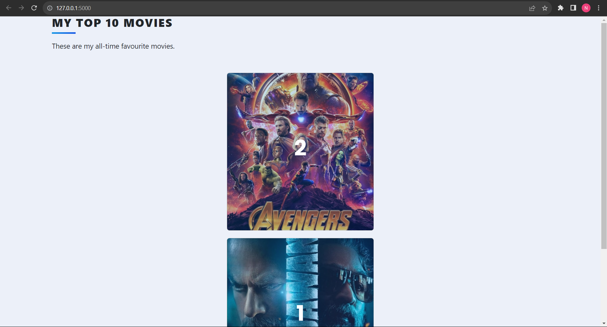
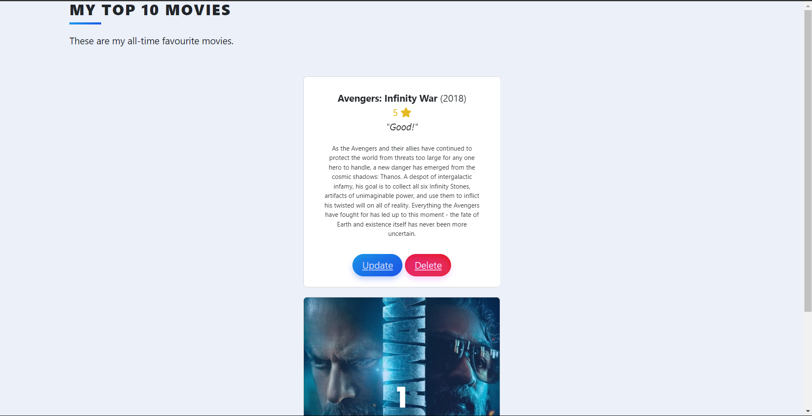

# Movie Review Web App

This repository contains a Flask web application for managing movie reviews. Users can add, edit, and delete reviews for movies. The application integrates with **The Movie Database (TMDb) API** to fetch movie details based on user input.

## Features
- **Home Page:** Displays a list of movies with details such as title, year, description, rating, and review. Movies are ranked based on user ratings.
- **Edit Page:** Allows users to modify the rating and review for a selected movie.
- **Delete Functionality:** Enables users to remove a movie from the database.
- **Add Movie:** Users can add a new movie by searching for its title. The application fetches relevant details from the TMDb API and allows the user to select the desired movie.

## Getting Started
1. **Clone the repository:**
    ```bash
    git clone https://github.com/Nishanth200/Favorite-Movie-Ranking.git
    cd Favorite-Movie-Ranking-App
    ```

2. **Install dependencies:**
    ```bash
    pip install -r requirements.txt
    ```

3. **Obtain API keys:**
   - TMDb API key: [Get it here](https://www.themoviedb.org/settings/api)
   - Authorization key: (If required by TMDb API)

4. **Configure the application:**
   - Open `app.py` and replace the placeholder values for `TMDB_API_KEY` and `headers["Authorization"]` with your actual TMDb API key and authorization key.

5. **Run the application:**
    ```bash
    python app.py
    ```
    Open your web browser and go to [http://localhost:5000](http://localhost:5000) to access the application.

## Usage
### Adding a Movie:
1. Click on the "Add Movie" button on the home page.
2. Enter the title of the movie you want to add.
3. Select the desired movie from the search results.
4. Confirm the addition on the following page.

### Editing a Movie:
1. Click on the "Edit" button next to the movie on the home page.
2. Update the rating and review.
3. Click on the "Edit" button to save the changes.

### Deleting a Movie:
1. Click on the "Delete" button next to the movie on the home page.
2. Confirm the deletion.

## Contributing
Contributions are welcome! If you find any issues or have suggestions for improvements, please open an issue or create a pull request.

## Acknowledgments
- This application was built using Flask, SQLAlchemy, and Bootstrap.
- Movie data is fetched from The Movie Database (TMDb) API.

Feel free to customize the application according to your needs and contribute to its development. Enjoy managing your movie reviews!

## Screenshots


